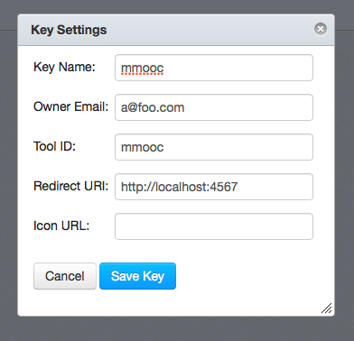
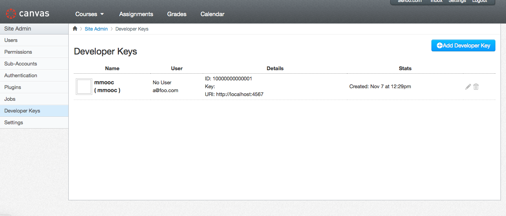

INSTALL
=======

Create a developer key

Take note of the key ID and token. The token will appear when hovering over it.

Create a file name .env with the following content

    API_HOST=...
    API_PORT=...
    API_CLIENT_ID=...
    API_CLIENT_KEY=...

Install dependencies

    gem install bundler
    bundle install

Start the server

    bundle exec ruby app.rb

Point a browser to `http://localhost:4567`
